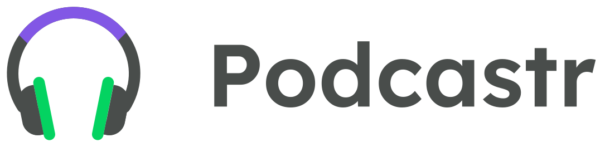
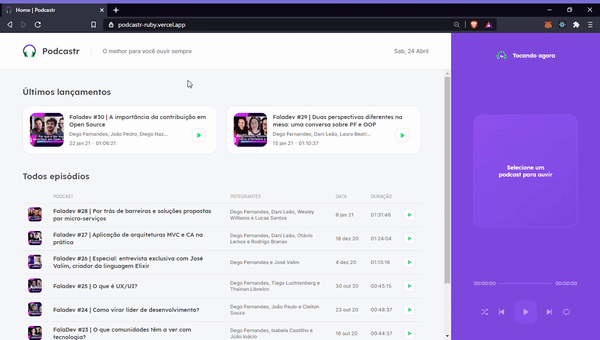

<h1 align="center">
    
</h1>




## 💻 Projeto

O Podcastr é um app para ouvir podcasts sobre programação.

## 🎨 Layout
Você pode acessar o Layout pelo Figma atravês desse [link](https://www.figma.com/file/5KchzYko8NeeV0suqrSi6x/Podcastr-(Copy)?node-id=199599%3A1028).

## 🧪 Tecnologias

Este projeto foi desenvolvido com as seguintes tecnologias
- [Next.js](https://nextjs.org/)
- [React.js](https://pt-br.reactjs.org/)
- [TypeScript](https://www.typescriptlang.org/)
- [Sass](https://sass-lang.com/)

## 📋 Funcionalidades
- [x] Tocar podcast.
- [x] Quando um podcast acaba, outro começa em seguida.
- [x] Selecionar apenas um podcast para ouvir.
- [x] Opção de ir para o próximo podcast.
- [x] Opção de ir para o anterior podcast.
- [x] Opção de Loop.
- [x] Opção para embaralhar.

## 🚀 Como instalar
```
# Clone este repositório.
# Vá para a pasta podcastr
$ cd podcastr

# Instale as dependências
$ npm install

# Execute aplicação
$ npm run dev

# O app vai está rodando na porta 3000 - acesse <http://localhost:3000>

```
---

<p>Feito com 💜 by Lucas Barque da Silva</p>

[](https://www.linkedin.com/in/lucas-barque/)
[](mailto:lucasbarquedasilva@hotmail.com)
